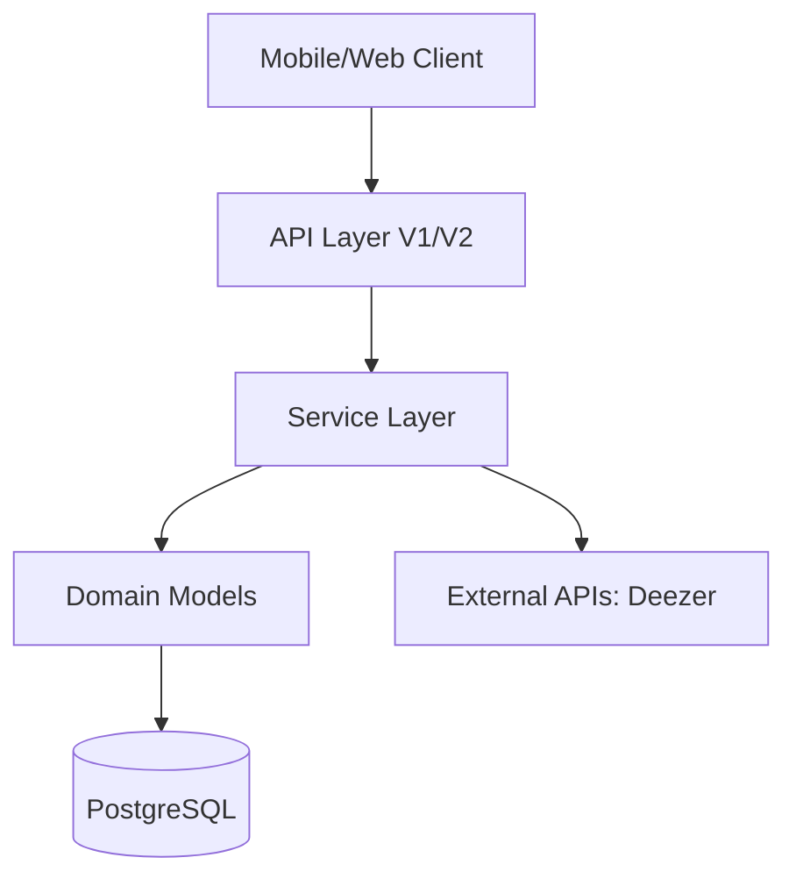

# Listify Backend 🎧

Listify is a professional, scalable social music API built with **Ruby on Rails 8**. It addresses the complexities of social graphs, music metadata synchronization, and real-time feeds with a focus on architectural integrity and mobile-first performance.

---

## 🏗 Architecture Overview

Listify follows a **Service-Oriented Architecture (SOA)** to ensure controllers remain lean and business logic is encapsulated.



### Key Architectural Pillars:
- **Service Objects**: Encapsulated business logic (e.g., `Social::FollowUserService`, `Music::DeezerSyncService`).
- **RESTful Discipline**: Resource-oriented routing for social relationships and data management.
- **Stateless Auth + Refresh**: Short-lived JWTs with secure, rotating Refresh Tokens.
- **Declarative Serialization**: Lightning-fast JSON responses via `Blueprinter`.
- **Global Logout**: Identity-level revocation via `jwt_version` on the User model.

---

## 🔐 Security & Auth Flow

### JWT Rotation Strategy
1. **Login**: User receives `access_token` (expires in 1hr) and `refresh_token` (expires in 30 days).
2. **Refresh**: When `access_token` expires, POST the `refresh_token` to `/api/v2/refresh_tokens`.
3. **Rotation**: The server revokes the old `refresh_token` and issues a BRAND NEW pair.

### Global Logout
Incrementing the `jwt_version` on the User record instantly invalidates all active JWTs for that account.

---

## 📡 API Reference

### Authentication
| Endpoint | Method | Description |
| :--- | :--- | :--- |
| `/api/v1/auth/login` | POST | Authenticate and receive tokens. |
| `/api/v2/refresh_tokens` | POST | Rotate tokens using a valid refresh token. |

### Social & Feeds
| Endpoint | Method | Description |
| :--- | :--- | :--- |
| `/api/v1/feed/following` | GET | Paginated activity feed from followed users. |
| `/api/v1/feed/explore` | GET | Discovery feed of global activities. |
| `/api/v1/users/:id/follow` | POST | Follow a user (Resource-based logic). |

### Music Discovery
| Endpoint | Method | Description |
| :--- | :--- | :--- |
| `/api/v1/songs` | GET | List all songs (Paginated). |
| `/api/v2/songs/sync` | POST | Trigger Deezer API ingestion. |

---

## 📦 Data Schema (Example Response)
```json
{
  "user": {
    "id": 1,
    "username": "daft_punk",
    "profile_picture_url": "https://..."
  },
  "refresh_token": "a1b2c3d4...",
  "jwt_version": 1
}
```

---

## 🏁 Getting Started

1. **Prerequisites**: Ruby 3.3+, PostgreSQL (recommended). For local development and testing on Windows, the project supports SQLite3 as a fallback (see `Gemfile`).
2. **Setup**:
   ```bash
   bundle install
   rails db:prepare
   ```
3. **Run**:
   ```bash
   rails s
   ```
4. **Test**:
   ```bash
   rails test
   ```

---

## 🛠 Tech Stack
- **Framework**: Rails 8.0
- **Serialization**: Blueprinter
- **Authentication**: Devise + JWT
- **Pagination**: Kaminari
- **Validations**: ActiveStorage Validations
- **Cloud Storage**: ActiveStorage (libvips)

---

## 📚 Full documentation
Detailed developer and API documentation is available in the `docs/` directory:

- `docs/architecture.md` — Architecture overview and diagrams
- `docs/api.md` — API endpoints, examples, authentication, pagination, error formats
- `docs/developer.md` — Local setup, code style, tooling
- `docs/testing.md` — Running tests, stubbing external APIs and CI notes
- `CONTRIBUTING.md` — How to contribute and PR checklist

You can also find an OpenAPI spec at `docs/openapi.yaml` (if present).
